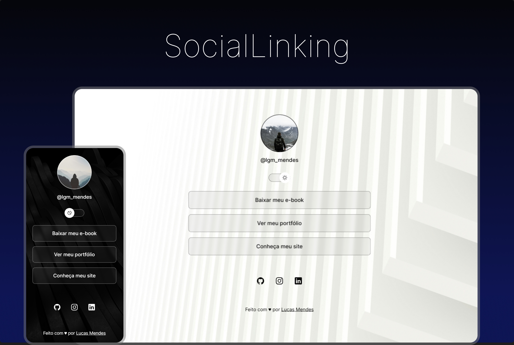

<h1 align="center"> SocialLinking </h1>

Repositório criado com a finalidade de demonstrar a ferramenta de agregação de links, incluindo a opção de alternar entre dark ou light mode.  

  <a href="#-tecnologias">Tecnologias</a>&nbsp;&nbsp;&nbsp;|&nbsp;&nbsp;&nbsp;
  <a href="#-projeto">Projeto</a>

 

  

## 🌐 Tecnologias

Esse projeto foi desenvolvido utilizando as seguintes tecnologias:

- HTML
- CSS
- JavaScript
- Git
- Github
- Figma

## 🔗 Projeto

O SocialLinking é um agregador de links para usar como cartão de visitas online.

- [Acesse o projeto finalizado, online](https://lgm-mendes.github.io/social-linking)

---

 

  Feito com ♥ por Lucas Mendes 

